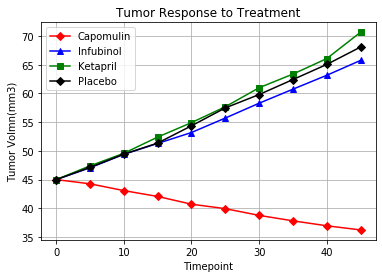
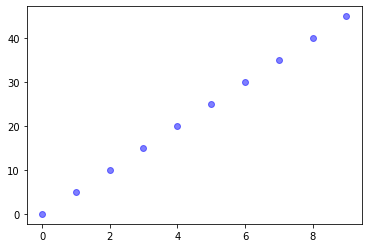
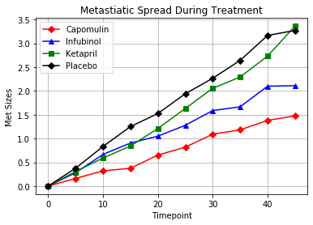
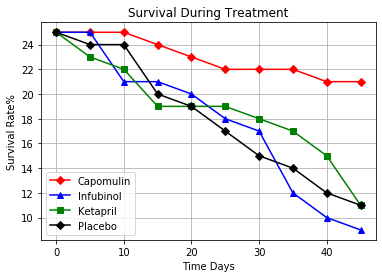
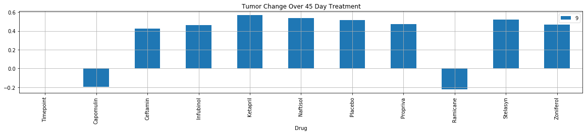

```python
# Dependencies and Setup
%matplotlib inline
import matplotlib.pyplot as plt
import pandas as pd
import numpy as np
from scipy.stats import sem

# Hide warning messages in notebook
import warnings
warnings.filterwarnings('ignore')

# File to Load (Remember to Change These)
mouse_drug_data_to_load = "data/mouse_drug_data.csv"
clinical_trial_data_to_load = "data/clinicaltrial_data.csv"

# Read the Mouse and Drug Data and the Clinical Trial Data
mouse=pd.read_csv(mouse_drug_data_to_load)
clinical=pd.read_csv(clinical_trial_data_to_load)

# Combine the data into a single dataset
mouse_clinical_combined=pd.merge(mouse, clinical, on="Mouse ID",how="outer")
# Display the data table for preview
mouse_clinical_combined.head()

```


<div>
<style scoped>
    .dataframe tbody tr th:only-of-type {
        vertical-align: middle;
    }

    .dataframe tbody tr th {
        vertical-align: top;
    }

    .dataframe thead th {
        text-align: right;
    }
</style>
<table border="1" class="dataframe">
  <thead>
    <tr style="text-align: right;">
      <th></th>
      <th>Mouse ID</th>
      <th>Drug</th>
      <th>Timepoint</th>
      <th>Tumor Volume (mm3)</th>
      <th>Metastatic Sites</th>
    </tr>
  </thead>
  <tbody>
    <tr>
      <th>0</th>
      <td>f234</td>
      <td>Stelasyn</td>
      <td>0</td>
      <td>45.000000</td>
      <td>0</td>
    </tr>
    <tr>
      <th>1</th>
      <td>f234</td>
      <td>Stelasyn</td>
      <td>5</td>
      <td>47.313491</td>
      <td>0</td>
    </tr>
    <tr>
      <th>2</th>
      <td>f234</td>
      <td>Stelasyn</td>
      <td>10</td>
      <td>47.904324</td>
      <td>0</td>
    </tr>
    <tr>
      <th>3</th>
      <td>f234</td>
      <td>Stelasyn</td>
      <td>15</td>
      <td>48.735197</td>
      <td>1</td>
    </tr>
    <tr>
      <th>4</th>
      <td>f234</td>
      <td>Stelasyn</td>
      <td>20</td>
      <td>51.112713</td>
      <td>2</td>
    </tr>
  </tbody>
</table>
</div>


## Tumor Response to Treatment


```python
# Store the Mean Tumor Volume Data Grouped by Drug and Timepoint 

Summary_mean=mouse_clinical_combined.reset_index().pivot_table(values="Tumor Volume (mm3)",index=["Drug","Timepoint"],aggfunc="mean",fill_value=1)
# Convert to DataFrame
Summary_mean.head()
# Preview DataFrame

```


<div>
<style scoped>
    .dataframe tbody tr th:only-of-type {
        vertical-align: middle;
    }

    .dataframe tbody tr th {
        vertical-align: top;
    }

    .dataframe thead th {
        text-align: right;
    }
</style>
<table border="1" class="dataframe">
  <thead>
    <tr style="text-align: right;">
      <th></th>
      <th></th>
      <th>Tumor Volume (mm3)</th>
    </tr>
    <tr>
      <th>Drug</th>
      <th>Timepoint</th>
      <th></th>
    </tr>
  </thead>
  <tbody>
    <tr>
      <th rowspan="5" valign="top">Capomulin</th>
      <th>0</th>
      <td>45.000000</td>
    </tr>
    <tr>
      <th>5</th>
      <td>44.266086</td>
    </tr>
    <tr>
      <th>10</th>
      <td>43.084291</td>
    </tr>
    <tr>
      <th>15</th>
      <td>42.064317</td>
    </tr>
    <tr>
      <th>20</th>
      <td>40.716325</td>
    </tr>
  </tbody>
</table>
</div>


```python

```


<div>
<style scoped>
    .dataframe tbody tr th:only-of-type {
        vertical-align: middle;
    }

    .dataframe tbody tr th {
        vertical-align: top;
    }

    .dataframe thead th {
        text-align: right;
    }
</style>
<table border="1" class="dataframe">
  <thead>
    <tr style="text-align: right;">
      <th></th>
      <th>Drug</th>
      <th>Timepoint</th>
      <th>Tumor Volume (mm3)</th>
    </tr>
  </thead>
  <tbody>
    <tr>
      <th>0</th>
      <td>Capomulin</td>
      <td>0</td>
      <td>45.000000</td>
    </tr>
    <tr>
      <th>1</th>
      <td>Capomulin</td>
      <td>5</td>
      <td>44.266086</td>
    </tr>
    <tr>
      <th>2</th>
      <td>Capomulin</td>
      <td>10</td>
      <td>43.084291</td>
    </tr>
    <tr>
      <th>3</th>
      <td>Capomulin</td>
      <td>15</td>
      <td>42.064317</td>
    </tr>
    <tr>
      <th>4</th>
      <td>Capomulin</td>
      <td>20</td>
      <td>40.716325</td>
    </tr>
    <tr>
      <th>5</th>
      <td>Capomulin</td>
      <td>25</td>
      <td>39.939528</td>
    </tr>
    <tr>
      <th>6</th>
      <td>Capomulin</td>
      <td>30</td>
      <td>38.769339</td>
    </tr>
    <tr>
      <th>7</th>
      <td>Capomulin</td>
      <td>35</td>
      <td>37.816839</td>
    </tr>
    <tr>
      <th>8</th>
      <td>Capomulin</td>
      <td>40</td>
      <td>36.958001</td>
    </tr>
    <tr>
      <th>9</th>
      <td>Capomulin</td>
      <td>45</td>
      <td>36.236114</td>
    </tr>
    <tr>
      <th>10</th>
      <td>Ceftamin</td>
      <td>0</td>
      <td>45.000000</td>
    </tr>
    <tr>
      <th>11</th>
      <td>Ceftamin</td>
      <td>5</td>
      <td>46.503051</td>
    </tr>
    <tr>
      <th>12</th>
      <td>Ceftamin</td>
      <td>10</td>
      <td>48.285125</td>
    </tr>
    <tr>
      <th>13</th>
      <td>Ceftamin</td>
      <td>15</td>
      <td>50.094055</td>
    </tr>
    <tr>
      <th>14</th>
      <td>Ceftamin</td>
      <td>20</td>
      <td>52.157049</td>
    </tr>
    <tr>
      <th>15</th>
      <td>Ceftamin</td>
      <td>25</td>
      <td>54.287674</td>
    </tr>
    <tr>
      <th>16</th>
      <td>Ceftamin</td>
      <td>30</td>
      <td>56.769517</td>
    </tr>
    <tr>
      <th>17</th>
      <td>Ceftamin</td>
      <td>35</td>
      <td>58.827548</td>
    </tr>
    <tr>
      <th>18</th>
      <td>Ceftamin</td>
      <td>40</td>
      <td>61.467895</td>
    </tr>
    <tr>
      <th>19</th>
      <td>Ceftamin</td>
      <td>45</td>
      <td>64.132421</td>
    </tr>
    <tr>
      <th>20</th>
      <td>Infubinol</td>
      <td>0</td>
      <td>45.000000</td>
    </tr>
    <tr>
      <th>21</th>
      <td>Infubinol</td>
      <td>5</td>
      <td>47.062001</td>
    </tr>
    <tr>
      <th>22</th>
      <td>Infubinol</td>
      <td>10</td>
      <td>49.403909</td>
    </tr>
    <tr>
      <th>23</th>
      <td>Infubinol</td>
      <td>15</td>
      <td>51.296397</td>
    </tr>
    <tr>
      <th>24</th>
      <td>Infubinol</td>
      <td>20</td>
      <td>53.197691</td>
    </tr>
    <tr>
      <th>25</th>
      <td>Infubinol</td>
      <td>25</td>
      <td>55.715252</td>
    </tr>
    <tr>
      <th>26</th>
      <td>Infubinol</td>
      <td>30</td>
      <td>58.299397</td>
    </tr>
    <tr>
      <th>27</th>
      <td>Infubinol</td>
      <td>35</td>
      <td>60.742461</td>
    </tr>
    <tr>
      <th>28</th>
      <td>Infubinol</td>
      <td>40</td>
      <td>63.162824</td>
    </tr>
    <tr>
      <th>29</th>
      <td>Infubinol</td>
      <td>45</td>
      <td>65.755562</td>
    </tr>
    <tr>
      <th>...</th>
      <td>...</td>
      <td>...</td>
      <td>...</td>
    </tr>
    <tr>
      <th>70</th>
      <td>Ramicane</td>
      <td>0</td>
      <td>45.000000</td>
    </tr>
    <tr>
      <th>71</th>
      <td>Ramicane</td>
      <td>5</td>
      <td>43.944859</td>
    </tr>
    <tr>
      <th>72</th>
      <td>Ramicane</td>
      <td>10</td>
      <td>42.531957</td>
    </tr>
    <tr>
      <th>73</th>
      <td>Ramicane</td>
      <td>15</td>
      <td>41.495061</td>
    </tr>
    <tr>
      <th>74</th>
      <td>Ramicane</td>
      <td>20</td>
      <td>40.238325</td>
    </tr>
    <tr>
      <th>75</th>
      <td>Ramicane</td>
      <td>25</td>
      <td>38.974300</td>
    </tr>
    <tr>
      <th>76</th>
      <td>Ramicane</td>
      <td>30</td>
      <td>38.703137</td>
    </tr>
    <tr>
      <th>77</th>
      <td>Ramicane</td>
      <td>35</td>
      <td>37.451996</td>
    </tr>
    <tr>
      <th>78</th>
      <td>Ramicane</td>
      <td>40</td>
      <td>36.574081</td>
    </tr>
    <tr>
      <th>79</th>
      <td>Ramicane</td>
      <td>45</td>
      <td>34.955595</td>
    </tr>
    <tr>
      <th>80</th>
      <td>Stelasyn</td>
      <td>0</td>
      <td>45.000000</td>
    </tr>
    <tr>
      <th>81</th>
      <td>Stelasyn</td>
      <td>5</td>
      <td>47.527452</td>
    </tr>
    <tr>
      <th>82</th>
      <td>Stelasyn</td>
      <td>10</td>
      <td>49.463844</td>
    </tr>
    <tr>
      <th>83</th>
      <td>Stelasyn</td>
      <td>15</td>
      <td>51.529409</td>
    </tr>
    <tr>
      <th>84</th>
      <td>Stelasyn</td>
      <td>20</td>
      <td>54.067395</td>
    </tr>
    <tr>
      <th>85</th>
      <td>Stelasyn</td>
      <td>25</td>
      <td>56.166123</td>
    </tr>
    <tr>
      <th>86</th>
      <td>Stelasyn</td>
      <td>30</td>
      <td>59.826738</td>
    </tr>
    <tr>
      <th>87</th>
      <td>Stelasyn</td>
      <td>35</td>
      <td>62.440699</td>
    </tr>
    <tr>
      <th>88</th>
      <td>Stelasyn</td>
      <td>40</td>
      <td>65.356386</td>
    </tr>
    <tr>
      <th>89</th>
      <td>Stelasyn</td>
      <td>45</td>
      <td>68.438310</td>
    </tr>
    <tr>
      <th>90</th>
      <td>Zoniferol</td>
      <td>0</td>
      <td>45.000000</td>
    </tr>
    <tr>
      <th>91</th>
      <td>Zoniferol</td>
      <td>5</td>
      <td>46.851818</td>
    </tr>
    <tr>
      <th>92</th>
      <td>Zoniferol</td>
      <td>10</td>
      <td>48.689881</td>
    </tr>
    <tr>
      <th>93</th>
      <td>Zoniferol</td>
      <td>15</td>
      <td>50.779059</td>
    </tr>
    <tr>
      <th>94</th>
      <td>Zoniferol</td>
      <td>20</td>
      <td>53.170334</td>
    </tr>
    <tr>
      <th>95</th>
      <td>Zoniferol</td>
      <td>25</td>
      <td>55.432935</td>
    </tr>
    <tr>
      <th>96</th>
      <td>Zoniferol</td>
      <td>30</td>
      <td>57.713531</td>
    </tr>
    <tr>
      <th>97</th>
      <td>Zoniferol</td>
      <td>35</td>
      <td>60.089372</td>
    </tr>
    <tr>
      <th>98</th>
      <td>Zoniferol</td>
      <td>40</td>
      <td>62.916692</td>
    </tr>
    <tr>
      <th>99</th>
      <td>Zoniferol</td>
      <td>45</td>
      <td>65.960888</td>
    </tr>
  </tbody>
</table>
<p>100 rows × 3 columns</p>
</div>


```python
# Store the Standard Error of Tumor Volumes Grouped by Drug and Timepoint
from scipy.stats import sem
Summary_se=mouse_clinical_combined.reset_index().pivot_table(values="Tumor Volume (mm3)",index=["Drug","Timepoint"],aggfunc=sem,fill_value=1)
# Convert to DataFrame
Summary_se.head()
# Convert to DataFrame

# Preview DataFrame


```


<div>
<style scoped>
    .dataframe tbody tr th:only-of-type {
        vertical-align: middle;
    }

    .dataframe tbody tr th {
        vertical-align: top;
    }

    .dataframe thead th {
        text-align: right;
    }
</style>
<table border="1" class="dataframe">
  <thead>
    <tr style="text-align: right;">
      <th></th>
      <th></th>
      <th>Tumor Volume (mm3)</th>
    </tr>
    <tr>
      <th>Drug</th>
      <th>Timepoint</th>
      <th></th>
    </tr>
  </thead>
  <tbody>
    <tr>
      <th rowspan="5" valign="top">Capomulin</th>
      <th>0</th>
      <td>0.000000</td>
    </tr>
    <tr>
      <th>5</th>
      <td>0.448593</td>
    </tr>
    <tr>
      <th>10</th>
      <td>0.702684</td>
    </tr>
    <tr>
      <th>15</th>
      <td>0.838617</td>
    </tr>
    <tr>
      <th>20</th>
      <td>0.909731</td>
    </tr>
  </tbody>
</table>
</div>


```python

```


```python

```


<div>
<style scoped>
    .dataframe tbody tr th:only-of-type {
        vertical-align: middle;
    }

    .dataframe tbody tr th {
        vertical-align: top;
    }

    .dataframe thead th {
        text-align: right;
    }
</style>
<table border="1" class="dataframe">
  <thead>
    <tr style="text-align: right;">
      <th></th>
      <th>Drug</th>
      <th>Timepoint</th>
      <th>Tumor Volume (mm3)</th>
    </tr>
  </thead>
  <tbody>
    <tr>
      <th>0</th>
      <td>Capomulin</td>
      <td>0</td>
      <td>0.000000</td>
    </tr>
    <tr>
      <th>1</th>
      <td>Capomulin</td>
      <td>5</td>
      <td>0.448593</td>
    </tr>
    <tr>
      <th>2</th>
      <td>Capomulin</td>
      <td>10</td>
      <td>0.702684</td>
    </tr>
    <tr>
      <th>3</th>
      <td>Capomulin</td>
      <td>15</td>
      <td>0.838617</td>
    </tr>
    <tr>
      <th>4</th>
      <td>Capomulin</td>
      <td>20</td>
      <td>0.909731</td>
    </tr>
  </tbody>
</table>
</div>


```python

```


```python
# Minor Data Munging to Re-Format the Data Frames
Summary_reformat=mouse_clinical_combined.reset_index().pivot_table(values="Tumor Volume (mm3)",index=["Timepoint"],columns=["Drug"],aggfunc="mean",fill_value=1)
# Convert to DataFrame
Summary_reformat_df=pd.DataFrame(Summary_reformat).reset_index()
# Preview that Reformatting worked
Summary_reformat_df.head()
```


<div>
<style scoped>
    .dataframe tbody tr th:only-of-type {
        vertical-align: middle;
    }

    .dataframe tbody tr th {
        vertical-align: top;
    }

    .dataframe thead th {
        text-align: right;
    }
</style>
<table border="1" class="dataframe">
  <thead>
    <tr style="text-align: right;">
      <th>Drug</th>
      <th>Timepoint</th>
      <th>Capomulin</th>
      <th>Ceftamin</th>
      <th>Infubinol</th>
      <th>Ketapril</th>
      <th>Naftisol</th>
      <th>Placebo</th>
      <th>Propriva</th>
      <th>Ramicane</th>
      <th>Stelasyn</th>
      <th>Zoniferol</th>
    </tr>
  </thead>
  <tbody>
    <tr>
      <th>0</th>
      <td>0</td>
      <td>45.000000</td>
      <td>45.000000</td>
      <td>45.000000</td>
      <td>45.000000</td>
      <td>45.000000</td>
      <td>45.000000</td>
      <td>45.000000</td>
      <td>45.000000</td>
      <td>45.000000</td>
      <td>45.000000</td>
    </tr>
    <tr>
      <th>1</th>
      <td>5</td>
      <td>44.266086</td>
      <td>46.503051</td>
      <td>47.062001</td>
      <td>47.389175</td>
      <td>46.796098</td>
      <td>47.125589</td>
      <td>47.248967</td>
      <td>43.944859</td>
      <td>47.527452</td>
      <td>46.851818</td>
    </tr>
    <tr>
      <th>2</th>
      <td>10</td>
      <td>43.084291</td>
      <td>48.285125</td>
      <td>49.403909</td>
      <td>49.582269</td>
      <td>48.694210</td>
      <td>49.423329</td>
      <td>49.101541</td>
      <td>42.531957</td>
      <td>49.463844</td>
      <td>48.689881</td>
    </tr>
    <tr>
      <th>3</th>
      <td>15</td>
      <td>42.064317</td>
      <td>50.094055</td>
      <td>51.296397</td>
      <td>52.399974</td>
      <td>50.933018</td>
      <td>51.359742</td>
      <td>51.067318</td>
      <td>41.495061</td>
      <td>51.529409</td>
      <td>50.779059</td>
    </tr>
    <tr>
      <th>4</th>
      <td>20</td>
      <td>40.716325</td>
      <td>52.157049</td>
      <td>53.197691</td>
      <td>54.920935</td>
      <td>53.644087</td>
      <td>54.364417</td>
      <td>53.346737</td>
      <td>40.238325</td>
      <td>54.067395</td>
      <td>53.170334</td>
    </tr>
  </tbody>
</table>
</div>


```python

```


<div>
<style scoped>
    .dataframe tbody tr th:only-of-type {
        vertical-align: middle;
    }

    .dataframe tbody tr th {
        vertical-align: top;
    }

    .dataframe thead th {
        text-align: right;
    }
</style>
<table border="1" class="dataframe">
  <thead>
    <tr style="text-align: right;">
      <th>Drug</th>
      <th>Capomulin</th>
      <th>Ceftamin</th>
      <th>Infubinol</th>
      <th>Ketapril</th>
      <th>Naftisol</th>
      <th>Placebo</th>
      <th>Propriva</th>
      <th>Ramicane</th>
      <th>Stelasyn</th>
      <th>Zoniferol</th>
    </tr>
    <tr>
      <th>Timepoint</th>
      <th></th>
      <th></th>
      <th></th>
      <th></th>
      <th></th>
      <th></th>
      <th></th>
      <th></th>
      <th></th>
      <th></th>
    </tr>
  </thead>
  <tbody>
    <tr>
      <th>0</th>
      <td>45.000000</td>
      <td>45.000000</td>
      <td>45.000000</td>
      <td>45.000000</td>
      <td>45.000000</td>
      <td>45.000000</td>
      <td>45.000000</td>
      <td>45.000000</td>
      <td>45.000000</td>
      <td>45.000000</td>
    </tr>
    <tr>
      <th>5</th>
      <td>44.266086</td>
      <td>46.503051</td>
      <td>47.062001</td>
      <td>47.389175</td>
      <td>46.796098</td>
      <td>47.125589</td>
      <td>47.248967</td>
      <td>43.944859</td>
      <td>47.527452</td>
      <td>46.851818</td>
    </tr>
    <tr>
      <th>10</th>
      <td>43.084291</td>
      <td>48.285125</td>
      <td>49.403909</td>
      <td>49.582269</td>
      <td>48.694210</td>
      <td>49.423329</td>
      <td>49.101541</td>
      <td>42.531957</td>
      <td>49.463844</td>
      <td>48.689881</td>
    </tr>
    <tr>
      <th>15</th>
      <td>42.064317</td>
      <td>50.094055</td>
      <td>51.296397</td>
      <td>52.399974</td>
      <td>50.933018</td>
      <td>51.359742</td>
      <td>51.067318</td>
      <td>41.495061</td>
      <td>51.529409</td>
      <td>50.779059</td>
    </tr>
    <tr>
      <th>20</th>
      <td>40.716325</td>
      <td>52.157049</td>
      <td>53.197691</td>
      <td>54.920935</td>
      <td>53.644087</td>
      <td>54.364417</td>
      <td>53.346737</td>
      <td>40.238325</td>
      <td>54.067395</td>
      <td>53.170334</td>
    </tr>
  </tbody>
</table>
</div>


```python
# Generate the Plot (with Error Bars)
Timepoint=Summary_reformat_df["Timepoint"]
Drug_Capomulin=Summary_reformat_df["Capomulin"]
Drug_Infubinol=Summary_reformat_df["Infubinol"]
Drug_Ketapril=Summary_reformat_df["Ketapril"]
Drug_Placebo=Summary_reformat_df["Placebo"]
Chart1,=plt.plot(Timepoint,Drug_Capomulin,marker="D",color="red",label="Capomulin")
Chart2,=plt.plot(Timepoint,Drug_Infubinol,marker="^",color="blue",label="Infubinol")
Chart3,=plt.plot(Timepoint,Drug_Ketapril,marker="s",color="green",label="Ketapril")
Chart4,=plt.plot(Timepoint,Drug_Placebo,marker="D",color="black",label="Placebo")

plt.legend(handles=[Chart1,Chart2,Chart3,Chart4,], loc="best")
plt.title("Tumor Response to Treatment")
plt.xlabel("Timepoint")
plt.ylabel("Tumor Volmn(mm3)")
plt.grid()
# Save the Figure


means_1=[np.mean(s) for s in Timepoint]
standard_errors_1 = [sem(s) for s in Timepoint]
fig, ax = plt.subplots()
ax.errorbar(np.arange(0, len(means_1)), means_1, standard_errors_1, fmt="o", color="b",
            alpha=0.5, label="Mean of House Prices")
```


    <ErrorbarContainer object of 3 artists>








```python

```


## Metastatic Response to Treatment


```python
# Store the Mean Met. Site Data Grouped by Drug and Timepoint 
 

Summary_metastatic=mouse_clinical_combined.reset_index().pivot_table(values="Metastatic Sites",index=["Drug","Timepoint"],aggfunc="mean",fill_value=1)
# Convert to DataFrame
Summary_metastatic.head()
# Preview DataFrame


```


<div>
<style scoped>
    .dataframe tbody tr th:only-of-type {
        vertical-align: middle;
    }

    .dataframe tbody tr th {
        vertical-align: top;
    }

    .dataframe thead th {
        text-align: right;
    }
</style>
<table border="1" class="dataframe">
  <thead>
    <tr style="text-align: right;">
      <th></th>
      <th></th>
      <th>Metastatic Sites</th>
    </tr>
    <tr>
      <th>Drug</th>
      <th>Timepoint</th>
      <th></th>
    </tr>
  </thead>
  <tbody>
    <tr>
      <th rowspan="5" valign="top">Capomulin</th>
      <th>0</th>
      <td>0.000000</td>
    </tr>
    <tr>
      <th>5</th>
      <td>0.160000</td>
    </tr>
    <tr>
      <th>10</th>
      <td>0.320000</td>
    </tr>
    <tr>
      <th>15</th>
      <td>0.375000</td>
    </tr>
    <tr>
      <th>20</th>
      <td>0.652174</td>
    </tr>
  </tbody>
</table>
</div>


```python

```


<div>
<style scoped>
    .dataframe tbody tr th:only-of-type {
        vertical-align: middle;
    }

    .dataframe tbody tr th {
        vertical-align: top;
    }

    .dataframe thead th {
        text-align: right;
    }
</style>
<table border="1" class="dataframe">
  <thead>
    <tr style="text-align: right;">
      <th></th>
      <th></th>
      <th>Metastatic Sites</th>
    </tr>
    <tr>
      <th>Drug</th>
      <th>Timepoint</th>
      <th></th>
    </tr>
  </thead>
  <tbody>
    <tr>
      <th rowspan="5" valign="top">Capomulin</th>
      <th>0</th>
      <td>0.000000</td>
    </tr>
    <tr>
      <th>5</th>
      <td>0.160000</td>
    </tr>
    <tr>
      <th>10</th>
      <td>0.320000</td>
    </tr>
    <tr>
      <th>15</th>
      <td>0.375000</td>
    </tr>
    <tr>
      <th>20</th>
      <td>0.652174</td>
    </tr>
  </tbody>
</table>
</div>


```python
# Store the Standard Error associated with Met. Sites Grouped by Drug and Timepoint 


Summary_metastatic_se=mouse_clinical_combined.reset_index().pivot_table(values="Metastatic Sites",index=["Drug","Timepoint"],aggfunc=sem,fill_value=1)
# Convert to DataFrame
Summary_metastatic_se.head()
# Preview DataFrame


```


<div>
<style scoped>
    .dataframe tbody tr th:only-of-type {
        vertical-align: middle;
    }

    .dataframe tbody tr th {
        vertical-align: top;
    }

    .dataframe thead th {
        text-align: right;
    }
</style>
<table border="1" class="dataframe">
  <thead>
    <tr style="text-align: right;">
      <th></th>
      <th></th>
      <th>Metastatic Sites</th>
    </tr>
    <tr>
      <th>Drug</th>
      <th>Timepoint</th>
      <th></th>
    </tr>
  </thead>
  <tbody>
    <tr>
      <th rowspan="5" valign="top">Capomulin</th>
      <th>0</th>
      <td>0.000000</td>
    </tr>
    <tr>
      <th>5</th>
      <td>0.074833</td>
    </tr>
    <tr>
      <th>10</th>
      <td>0.125433</td>
    </tr>
    <tr>
      <th>15</th>
      <td>0.132048</td>
    </tr>
    <tr>
      <th>20</th>
      <td>0.161621</td>
    </tr>
  </tbody>
</table>
</div>


```python

```


<div>
<style scoped>
    .dataframe tbody tr th:only-of-type {
        vertical-align: middle;
    }

    .dataframe tbody tr th {
        vertical-align: top;
    }

    .dataframe thead th {
        text-align: right;
    }
</style>
<table border="1" class="dataframe">
  <thead>
    <tr style="text-align: right;">
      <th></th>
      <th></th>
      <th>Metastatic Sites</th>
    </tr>
    <tr>
      <th>Drug</th>
      <th>Timepoint</th>
      <th></th>
    </tr>
  </thead>
  <tbody>
    <tr>
      <th rowspan="5" valign="top">Capomulin</th>
      <th>0</th>
      <td>0.000000</td>
    </tr>
    <tr>
      <th>5</th>
      <td>0.074833</td>
    </tr>
    <tr>
      <th>10</th>
      <td>0.125433</td>
    </tr>
    <tr>
      <th>15</th>
      <td>0.132048</td>
    </tr>
    <tr>
      <th>20</th>
      <td>0.161621</td>
    </tr>
  </tbody>
</table>
</div>


```python
# Minor Data Munging to Re-Format the Data Frames
Summary_reformat_meta=mouse_clinical_combined.reset_index().pivot_table(values="Metastatic Sites",index="Timepoint",columns="Drug",aggfunc="mean",fill_value=1)
# Convert to DataFrame
Summary_reformat_meta_df=pd.DataFrame(Summary_reformat_meta).reset_index()
# Preview that Reformatting worked
Summary_reformat_meta_df.head()
```


<div>
<style scoped>
    .dataframe tbody tr th:only-of-type {
        vertical-align: middle;
    }

    .dataframe tbody tr th {
        vertical-align: top;
    }

    .dataframe thead th {
        text-align: right;
    }
</style>
<table border="1" class="dataframe">
  <thead>
    <tr style="text-align: right;">
      <th>Drug</th>
      <th>Timepoint</th>
      <th>Capomulin</th>
      <th>Ceftamin</th>
      <th>Infubinol</th>
      <th>Ketapril</th>
      <th>Naftisol</th>
      <th>Placebo</th>
      <th>Propriva</th>
      <th>Ramicane</th>
      <th>Stelasyn</th>
      <th>Zoniferol</th>
    </tr>
  </thead>
  <tbody>
    <tr>
      <th>0</th>
      <td>0</td>
      <td>0.000000</td>
      <td>0.000000</td>
      <td>0.000000</td>
      <td>0.000000</td>
      <td>0.000000</td>
      <td>0.000000</td>
      <td>0.000000</td>
      <td>0.000000</td>
      <td>0.000000</td>
      <td>0.000000</td>
    </tr>
    <tr>
      <th>1</th>
      <td>5</td>
      <td>0.160000</td>
      <td>0.380952</td>
      <td>0.280000</td>
      <td>0.304348</td>
      <td>0.260870</td>
      <td>0.375000</td>
      <td>0.320000</td>
      <td>0.120000</td>
      <td>0.240000</td>
      <td>0.166667</td>
    </tr>
    <tr>
      <th>2</th>
      <td>10</td>
      <td>0.320000</td>
      <td>0.600000</td>
      <td>0.666667</td>
      <td>0.590909</td>
      <td>0.523810</td>
      <td>0.833333</td>
      <td>0.565217</td>
      <td>0.250000</td>
      <td>0.478261</td>
      <td>0.500000</td>
    </tr>
    <tr>
      <th>3</th>
      <td>15</td>
      <td>0.375000</td>
      <td>0.789474</td>
      <td>0.904762</td>
      <td>0.842105</td>
      <td>0.857143</td>
      <td>1.250000</td>
      <td>0.764706</td>
      <td>0.333333</td>
      <td>0.782609</td>
      <td>0.809524</td>
    </tr>
    <tr>
      <th>4</th>
      <td>20</td>
      <td>0.652174</td>
      <td>1.111111</td>
      <td>1.050000</td>
      <td>1.210526</td>
      <td>1.150000</td>
      <td>1.526316</td>
      <td>1.000000</td>
      <td>0.347826</td>
      <td>0.952381</td>
      <td>1.294118</td>
    </tr>
  </tbody>
</table>
</div>


```python

```


<div>
<style scoped>
    .dataframe tbody tr th:only-of-type {
        vertical-align: middle;
    }

    .dataframe tbody tr th {
        vertical-align: top;
    }

    .dataframe thead th {
        text-align: right;
    }
</style>
<table border="1" class="dataframe">
  <thead>
    <tr style="text-align: right;">
      <th>Drug</th>
      <th>Capomulin</th>
      <th>Ceftamin</th>
      <th>Infubinol</th>
      <th>Ketapril</th>
      <th>Naftisol</th>
      <th>Placebo</th>
      <th>Propriva</th>
      <th>Ramicane</th>
      <th>Stelasyn</th>
      <th>Zoniferol</th>
    </tr>
    <tr>
      <th>Timepoint</th>
      <th></th>
      <th></th>
      <th></th>
      <th></th>
      <th></th>
      <th></th>
      <th></th>
      <th></th>
      <th></th>
      <th></th>
    </tr>
  </thead>
  <tbody>
    <tr>
      <th>0</th>
      <td>45.000000</td>
      <td>45.000000</td>
      <td>45.000000</td>
      <td>45.000000</td>
      <td>45.000000</td>
      <td>45.000000</td>
      <td>45.000000</td>
      <td>45.000000</td>
      <td>45.000000</td>
      <td>45.000000</td>
    </tr>
    <tr>
      <th>5</th>
      <td>44.266086</td>
      <td>46.503051</td>
      <td>47.062001</td>
      <td>47.389175</td>
      <td>46.796098</td>
      <td>47.125589</td>
      <td>47.248967</td>
      <td>43.944859</td>
      <td>47.527452</td>
      <td>46.851818</td>
    </tr>
    <tr>
      <th>10</th>
      <td>43.084291</td>
      <td>48.285125</td>
      <td>49.403909</td>
      <td>49.582269</td>
      <td>48.694210</td>
      <td>49.423329</td>
      <td>49.101541</td>
      <td>42.531957</td>
      <td>49.463844</td>
      <td>48.689881</td>
    </tr>
    <tr>
      <th>15</th>
      <td>42.064317</td>
      <td>50.094055</td>
      <td>51.296397</td>
      <td>52.399974</td>
      <td>50.933018</td>
      <td>51.359742</td>
      <td>51.067318</td>
      <td>41.495061</td>
      <td>51.529409</td>
      <td>50.779059</td>
    </tr>
    <tr>
      <th>20</th>
      <td>40.716325</td>
      <td>52.157049</td>
      <td>53.197691</td>
      <td>54.920935</td>
      <td>53.644087</td>
      <td>54.364417</td>
      <td>53.346737</td>
      <td>40.238325</td>
      <td>54.067395</td>
      <td>53.170334</td>
    </tr>
  </tbody>
</table>
</div>


```python
# Generate the Plot (with Error Bars)
Timepoint_meta=Summary_reformat_meta_df["Timepoint"]
Drug_Capomulin_meta=Summary_reformat_meta_df["Capomulin"]
Drug_Infubinol_meta=Summary_reformat_meta_df["Infubinol"]
Drug_Ketapril_meta=Summary_reformat_meta_df["Ketapril"]
Drug_Placebo_meta=Summary_reformat_meta_df["Placebo"]
Chart1_meta,=plt.plot(Timepoint_meta,Drug_Capomulin_meta,marker="D",color="red",label="Capomulin")
Chart2_meta,=plt.plot(Timepoint_meta,Drug_Infubinol_meta,marker="^",color="blue",label="Infubinol")
Chart3_meta,=plt.plot(Timepoint_meta,Drug_Ketapril_meta,marker="s",color="green",label="Ketapril")
Chart4_meta,=plt.plot(Timepoint_meta,Drug_Placebo_meta,marker="D",color="black",label="Placebo")

plt.legend(handles=[Chart1_meta,Chart2_meta,Chart3_meta,Chart4_meta,], loc="best")
plt.title("Metastiatic Spread During Treatment")
plt.xlabel("Timepoint")
plt.ylabel("Met Sizes")
plt.grid()
# Save the Figure

# Save the Figure

# Show the Figure

```





```python
means_1=[np.mean(s) for s in Summary_reformat["Capomulin"]]
standard_errors_1 = [sem(s) for s in Summary_reformat["Capomulin"]]
fig, ax = plt.subplots()
ax.errorbar(np.arange(0, len(means_1)), means_1, standard_errors_1, fmt="o", color="b",
            alpha=0.5, label="Mean of House Prices")
```


```python

```


## Survival Rates


```python
# Store the Count of Mice Grouped by Drug and Timepoint (W can pass any metric)
Summary_mouse_count=mouse_clinical_combined.reset_index().pivot_table(values="Mouse ID",index=["Drug","Timepoint"],aggfunc="count",fill_value=1)
# Convert to DataFrame
Summary_mouse_count.head()
# Convert to DataFrame

# Preview DataFrame

```


<div>
<style scoped>
    .dataframe tbody tr th:only-of-type {
        vertical-align: middle;
    }

    .dataframe tbody tr th {
        vertical-align: top;
    }

    .dataframe thead th {
        text-align: right;
    }
</style>
<table border="1" class="dataframe">
  <thead>
    <tr style="text-align: right;">
      <th></th>
      <th></th>
      <th>Mouse ID</th>
    </tr>
    <tr>
      <th>Drug</th>
      <th>Timepoint</th>
      <th></th>
    </tr>
  </thead>
  <tbody>
    <tr>
      <th rowspan="5" valign="top">Capomulin</th>
      <th>0</th>
      <td>25</td>
    </tr>
    <tr>
      <th>5</th>
      <td>25</td>
    </tr>
    <tr>
      <th>10</th>
      <td>25</td>
    </tr>
    <tr>
      <th>15</th>
      <td>24</td>
    </tr>
    <tr>
      <th>20</th>
      <td>23</td>
    </tr>
  </tbody>
</table>
</div>


```python

```


```python

```


<div>
<style scoped>
    .dataframe tbody tr th:only-of-type {
        vertical-align: middle;
    }

    .dataframe tbody tr th {
        vertical-align: top;
    }

    .dataframe thead th {
        text-align: right;
    }
</style>
<table border="1" class="dataframe">
  <thead>
    <tr style="text-align: right;">
      <th></th>
      <th>Drug</th>
      <th>Timepoint</th>
      <th>Mouse Count</th>
    </tr>
  </thead>
  <tbody>
    <tr>
      <th>0</th>
      <td>Capomulin</td>
      <td>0</td>
      <td>25</td>
    </tr>
    <tr>
      <th>1</th>
      <td>Capomulin</td>
      <td>5</td>
      <td>25</td>
    </tr>
    <tr>
      <th>2</th>
      <td>Capomulin</td>
      <td>10</td>
      <td>25</td>
    </tr>
    <tr>
      <th>3</th>
      <td>Capomulin</td>
      <td>15</td>
      <td>24</td>
    </tr>
    <tr>
      <th>4</th>
      <td>Capomulin</td>
      <td>20</td>
      <td>23</td>
    </tr>
  </tbody>
</table>
</div>


```python
# Minor Data Munging to Re-Format the Data Frames
Summary_mouse_count_reformat=mouse_clinical_combined.reset_index().pivot_table(values="Mouse ID",index=["Timepoint"],columns=["Drug"],aggfunc="count",fill_value=1)
# Convert to DataFrame
Summary_mouse_count_reformat_df=pd.DataFrame(Summary_mouse_count_reformat).reset_index()
# Preview the Data Frame
Summary_mouse_count_reformat_df.head()
```


<div>
<style scoped>
    .dataframe tbody tr th:only-of-type {
        vertical-align: middle;
    }

    .dataframe tbody tr th {
        vertical-align: top;
    }

    .dataframe thead th {
        text-align: right;
    }
</style>
<table border="1" class="dataframe">
  <thead>
    <tr style="text-align: right;">
      <th>Drug</th>
      <th>Timepoint</th>
      <th>Capomulin</th>
      <th>Ceftamin</th>
      <th>Infubinol</th>
      <th>Ketapril</th>
      <th>Naftisol</th>
      <th>Placebo</th>
      <th>Propriva</th>
      <th>Ramicane</th>
      <th>Stelasyn</th>
      <th>Zoniferol</th>
    </tr>
  </thead>
  <tbody>
    <tr>
      <th>0</th>
      <td>0</td>
      <td>25</td>
      <td>25</td>
      <td>25</td>
      <td>25</td>
      <td>25</td>
      <td>25</td>
      <td>26</td>
      <td>25</td>
      <td>26</td>
      <td>25</td>
    </tr>
    <tr>
      <th>1</th>
      <td>5</td>
      <td>25</td>
      <td>21</td>
      <td>25</td>
      <td>23</td>
      <td>23</td>
      <td>24</td>
      <td>25</td>
      <td>25</td>
      <td>25</td>
      <td>24</td>
    </tr>
    <tr>
      <th>2</th>
      <td>10</td>
      <td>25</td>
      <td>20</td>
      <td>21</td>
      <td>22</td>
      <td>21</td>
      <td>24</td>
      <td>23</td>
      <td>24</td>
      <td>23</td>
      <td>22</td>
    </tr>
    <tr>
      <th>3</th>
      <td>15</td>
      <td>24</td>
      <td>19</td>
      <td>21</td>
      <td>19</td>
      <td>21</td>
      <td>20</td>
      <td>17</td>
      <td>24</td>
      <td>23</td>
      <td>21</td>
    </tr>
    <tr>
      <th>4</th>
      <td>20</td>
      <td>23</td>
      <td>18</td>
      <td>20</td>
      <td>19</td>
      <td>20</td>
      <td>19</td>
      <td>17</td>
      <td>23</td>
      <td>21</td>
      <td>17</td>
    </tr>
  </tbody>
</table>
</div>


```python

```


<div>
<style scoped>
    .dataframe tbody tr th:only-of-type {
        vertical-align: middle;
    }

    .dataframe tbody tr th {
        vertical-align: top;
    }

    .dataframe thead th {
        text-align: right;
    }
</style>
<table border="1" class="dataframe">
  <thead>
    <tr style="text-align: right;">
      <th>Drug</th>
      <th>Capomulin</th>
      <th>Ceftamin</th>
      <th>Infubinol</th>
      <th>Ketapril</th>
      <th>Naftisol</th>
      <th>Placebo</th>
      <th>Propriva</th>
      <th>Ramicane</th>
      <th>Stelasyn</th>
      <th>Zoniferol</th>
    </tr>
    <tr>
      <th>Timepoint</th>
      <th></th>
      <th></th>
      <th></th>
      <th></th>
      <th></th>
      <th></th>
      <th></th>
      <th></th>
      <th></th>
      <th></th>
    </tr>
  </thead>
  <tbody>
    <tr>
      <th>0</th>
      <td>25</td>
      <td>25</td>
      <td>25</td>
      <td>25</td>
      <td>25</td>
      <td>25</td>
      <td>26</td>
      <td>25</td>
      <td>26</td>
      <td>25</td>
    </tr>
    <tr>
      <th>5</th>
      <td>25</td>
      <td>21</td>
      <td>25</td>
      <td>23</td>
      <td>23</td>
      <td>24</td>
      <td>25</td>
      <td>25</td>
      <td>25</td>
      <td>24</td>
    </tr>
    <tr>
      <th>10</th>
      <td>25</td>
      <td>20</td>
      <td>21</td>
      <td>22</td>
      <td>21</td>
      <td>24</td>
      <td>23</td>
      <td>24</td>
      <td>23</td>
      <td>22</td>
    </tr>
    <tr>
      <th>15</th>
      <td>24</td>
      <td>19</td>
      <td>21</td>
      <td>19</td>
      <td>21</td>
      <td>20</td>
      <td>17</td>
      <td>24</td>
      <td>23</td>
      <td>21</td>
    </tr>
    <tr>
      <th>20</th>
      <td>23</td>
      <td>18</td>
      <td>20</td>
      <td>19</td>
      <td>20</td>
      <td>19</td>
      <td>17</td>
      <td>23</td>
      <td>21</td>
      <td>17</td>
    </tr>
  </tbody>
</table>
</div>


```python
# Generate the Plot (Accounting for percentages)
Timepoint_mouse_count=Summary_mouse_count_reformat_df["Timepoint"]
Drug_Capomulin_mouse_count=Summary_mouse_count_reformat_df["Capomulin"]
Drug_Infubinol_mouse_count=Summary_mouse_count_reformat_df["Infubinol"]
Drug_Ketapril_mouse_count=Summary_mouse_count_reformat_df["Ketapril"]
Drug_Placebo_mouse_count=Summary_mouse_count_reformat_df["Placebo"]
Chart1_mouse_count,=plt.plot(Timepoint_mouse_count,Drug_Capomulin_mouse_count,marker="D",color="red",label="Capomulin")
Chart2_mouse_count,=plt.plot(Timepoint_mouse_count,Drug_Infubinol_mouse_count,marker="^",color="blue",label="Infubinol")
Chart3_mouse_count,=plt.plot(Timepoint_mouse_count,Drug_Ketapril_mouse_count,marker="s",color="green",label="Ketapril")
Chart4_mouse_count,=plt.plot(Timepoint_mouse_count,Drug_Placebo_mouse_count,marker="D",color="black",label="Placebo")

plt.legend(handles=[Chart1_mouse_count,Chart2_mouse_count,Chart3_mouse_count,Chart4_mouse_count,], loc="best")
plt.title("Survival During Treatment")
plt.xlabel("Time Days")
plt.ylabel("Survival Rate%")
plt.grid()
# Save the Figure

# Show the Figure
plt.show()
```





```python

```


## Summary Bar Graph


```python
# Calculate the percent changes for each drug
Summary_First_Last=Summary_reformat_df.iloc[[0,-1]]
Summary_Percentage_Change=Summary_First_Last.pct_change(fill_method='ffill')
Summary_Percentage_Change.head()
Percent_Change=pd.DataFrame.transpose(Summary_Percentage_Change.iloc[[-1]])
Percent_Change
# Display the data to confirm

```


<div>
<style scoped>
    .dataframe tbody tr th:only-of-type {
        vertical-align: middle;
    }

    .dataframe tbody tr th {
        vertical-align: top;
    }

    .dataframe thead th {
        text-align: right;
    }
</style>
<table border="1" class="dataframe">
  <thead>
    <tr style="text-align: right;">
      <th></th>
      <th>9</th>
    </tr>
    <tr>
      <th>Drug</th>
      <th></th>
    </tr>
  </thead>
  <tbody>
    <tr>
      <th>Timepoint</th>
      <td>inf</td>
    </tr>
    <tr>
      <th>Capomulin</th>
      <td>-0.194753</td>
    </tr>
    <tr>
      <th>Ceftamin</th>
      <td>0.425165</td>
    </tr>
    <tr>
      <th>Infubinol</th>
      <td>0.461235</td>
    </tr>
    <tr>
      <th>Ketapril</th>
      <td>0.570288</td>
    </tr>
    <tr>
      <th>Naftisol</th>
      <td>0.539233</td>
    </tr>
    <tr>
      <th>Placebo</th>
      <td>0.512980</td>
    </tr>
    <tr>
      <th>Propriva</th>
      <td>0.472412</td>
    </tr>
    <tr>
      <th>Ramicane</th>
      <td>-0.223209</td>
    </tr>
    <tr>
      <th>Stelasyn</th>
      <td>0.520851</td>
    </tr>
    <tr>
      <th>Zoniferol</th>
      <td>0.465798</td>
    </tr>
  </tbody>
</table>
</div>


```python

```


```python

```


    Drug
    Capomulin   -19.475303
    Ceftamin     42.516492
    Infubinol    46.123472
    Ketapril     57.028795
    Naftisol     53.923347
    Placebo      51.297960
    Propriva     47.241175
    Ramicane    -22.320900
    Stelasyn     52.085134
    Zoniferol    46.579751
    dtype: float64


```python
# Store all Relevant Percent Changes into a Tuple

Percent_Change.plot(kind="bar", figsize=(20,3))

# Set a title for the chart
plt.title("Tumor Change Over 45 Day Treatment")
plt.grid()
plt.show()
plt.tight_layout()
# Splice the data between passing and failing drugs


# Orient widths. Add labels, tick marks, etc. 


# Use functions to label the percentages of changes


# Call functions to implement the function calls


# Save the Figure


# Show the Figure
fig.show()
```





    <Figure size 432x288 with 0 Axes>


```python

```


```python

```
